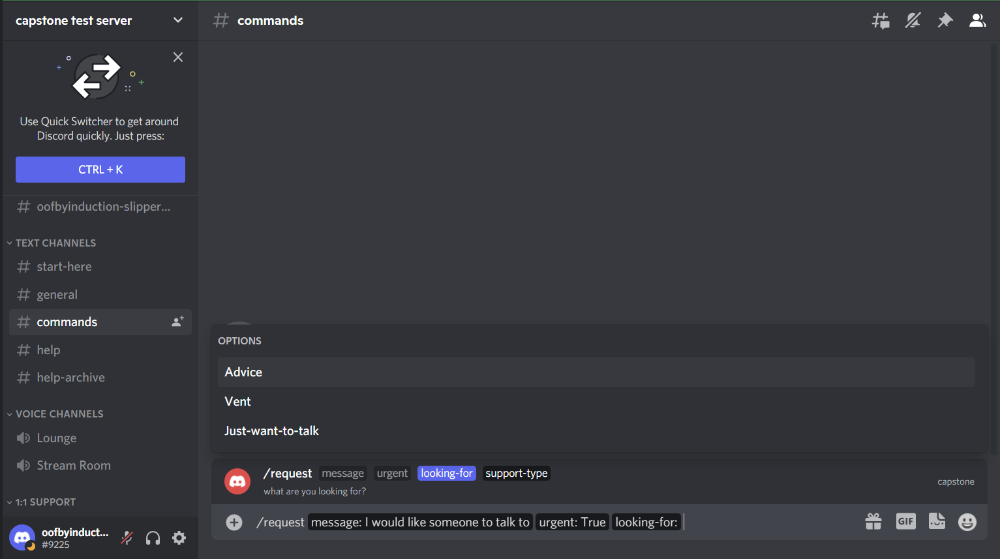
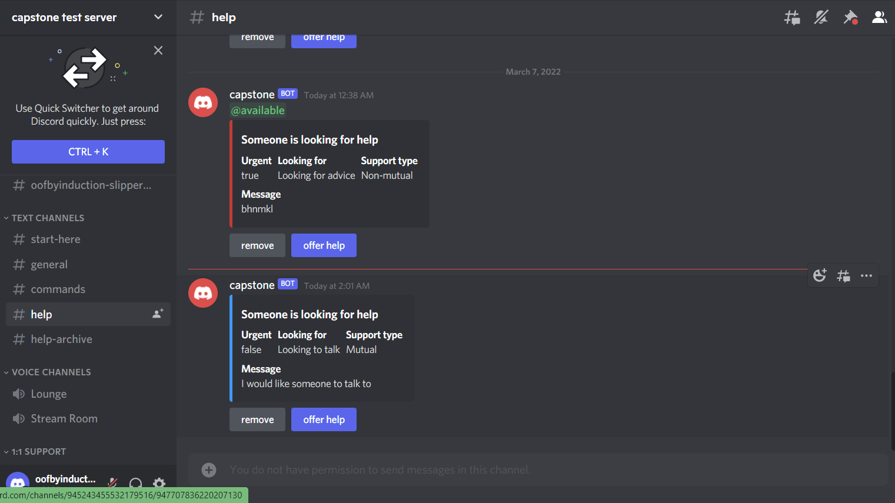
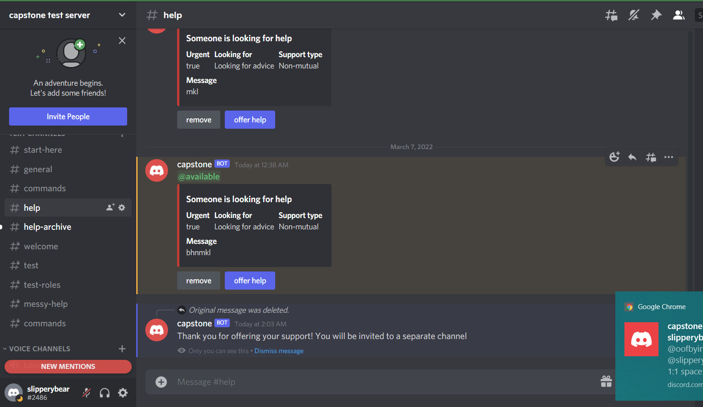
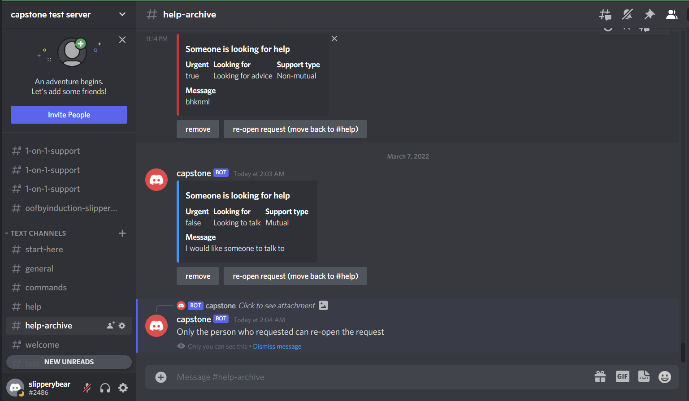
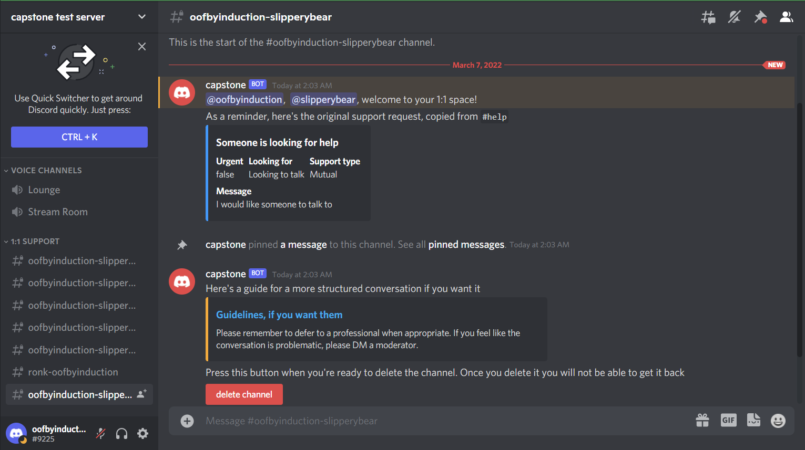

# G7: Digital Prototype
## Problem

The intention behind my bot is to help facilitate peer mental health support between friends or strangers. From my survey and literature review, people don’t always feel comfortable reaching out for emotional support even when they do want it. It can be scary to put yourself out there, especially when you’re already in a vulnerable situation. My bot aims to reduce some of the anxiety that comes with reaching out for help by providing a layer of anonymity and by scaffolding support conversations within a server, rather than requiring people to open up their direct messages. My target audience is people who use Discord who could use some emotional support or who have the energy and desire to support others.

## Bot overview

I made the bot using discord.js. I chose to go with Javascript because it seemed to be the most well-documented and supported language for making a Discord bot. I didn’t come across any significant shortcomings and was pleasantly surprised to find that pretty much everything I wanted to implement was possible. 

The bot I made goes with a server template for now. If I had more time, I’d probably try to make the bot more flexible and not require a certain template in order to function properly. Early on in the process of figuring out how to make a Discord bot (which I’d never done before!) I came across a tutorial that showed how to make a bot and host it on Replit. I’d never used Replit before, but it seemed lightweight (no downloading any software required!) and suitable for my needs, especially because it provides a way to host the bot without requiring me to make a database or pay for some sort of hosting service. 

## Bot Flow

The bot’s features follow one main flow. Person A feels in need of some support. They go to the Discord server and use a slash command to request support. Slash commands are ways you can interact with a bot in a Discord server without anyone else seeing. The person writes a blurb about how they’re feeling, and puts in other factors, such as the urgency of their request, whether they’re looking for advice or just venting, and whether they are able to give mutual support or not. The bot takes this information and posts it to a channel called #help. In this channel are all the active requests for support. Person A’s request has now been made visible, but they are anonymous. 

_(Above) Person A putting in a request for support via slash command_

_(Above) Person A is able to preview their message and confirm it is okay before sending it to #help_

_(Above) Person A can see their request for support is now publicly visible in #help, but is anonymous_

At the same time, Person B may also be feeling sad or they may be feeling fine. They have notifications on for urgent requests for support and get notified when person A’s message appears in #help. They read the message and find that they can support the person behind the message. They click a button to offer their support. The request is no longer considered active, so it gets moved to an archive channel with other past requests. Person A is able to move their request back to #help if they feel like they still need support. 

_(Above) Person B has clicked “offer help”, so the message gets removed from #help_

_(Above) The message now shows up in #help-archive. If person B tries to move the message back to #help, they see a message telling them only the original requester can move the message back. The same goes for removing a message from #help or #help-archive–only the original requester can do it_

Once person B clicks the button, the bot creates a private space where person A and person B can have a conversation within the server, where moderators have access to the channel and neither person has to open their DMs. The bot also can be configured to provide guidance on the conversation. Once the conversation is over, the bot can delete the chat so private information isn’t lying around. 

_(Above) Person A and person B are connected in a private chat within the server. The bot displays the original request message, a link to some conversation guidelines, and a button for deleting the chat once the conversation is finished_

## Adjustments

I made some adjustments to the original design based on more user tests. I added more parameters when sending the request for support. Originally I only had urgency and the message part was optional. I changed it to be required. I added the archive channel for past requests, rather than deleting them, so people can see examples of requests and also so that the original requester can re-open their request for help if they don’t feel like they’ve gotten help from the first person who offered. I originally intended to have people leave the 1:1 channel after their conversation has ended, but I didn’t want someone to feel uncomfortable about leaving if they know the other person is still viewing the channel with access to the whole conversation. While people can still technically save screenshots of the conversation, I decided to have the conversation get deleted at the end, that way the information would be gone for both people. I worried about people adversarially deleting the chat in the middle of a conversation, so I put a time limit on it, making it so that the channel can only be deleted if the conversation has been inactive for more than two hours. I also added extra confirmation buttons for sending a request (so people can preview it first) and deleting a 1:1 chat.

Here are the instructions for trying out the bot! [https://github.com/UWSocialComputing/Savanna-Project](https://github.com/UWSocialComputing/Savanna-Project) 

